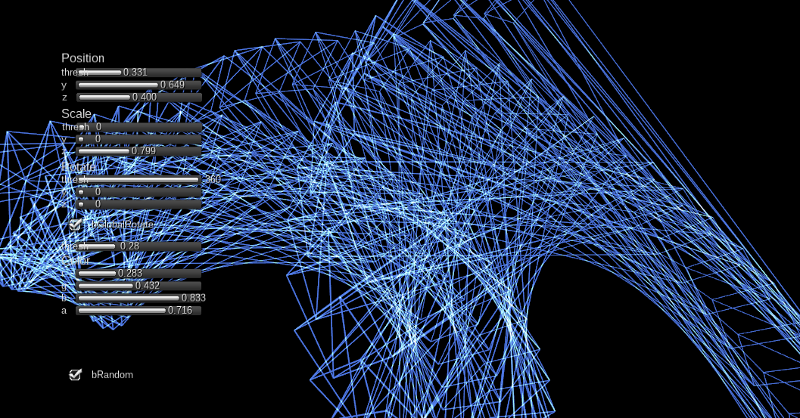

### What's this. これは？

Unity sound reactive visualizer based on [patternExample](https://github.com/kezzardrix/patternExample) by kezzardrix

kezzardrixさんが [プログラミングを用いた映像制作のコツ～パタンの組み合わせと繰り返し～｜Digital Imaging｜AMeeT](http://www.ameet.jp/digital-imaging/digital-imaging_20130831/)
で紹介・公開されている [patternExample](https://github.com/kezzardrix/patternExample) を参考に、Unityで似た表現を実装してみました。

### Usage ご利用方法

#### Clone > UnityでOpen
Cloneしたのち、UnityでOpen Project > Open Other kezzGeneCloneを選んでOpenします。この時点ではビルドエラーが表示されます。

#### NGUIの追加
有料のストアアセット [NGUI](http://u3d.as/content/tasharen-entertainment/ngui-next-gen-ui/2vh) を利用しています。Asset Store から入手してImportすると、ビルドが通るようになります

#### slnファイルなどの復活
MonoDevelopやVisual Studioでコードを編集する場合、ソリューションファイルがないと、インポートアセットも含めたクラスの関係性などが正しく導かれません。slnファイルを復活させるには、

``Assets > Sync MonoDevelop Project``

を行ってください

### 参考にさせていただいたコードなど

#### WireFrame表現
Unityでキレイなワイヤフレーム調の描画をするのに、[Wireframe Rendering? - Unity Answers](http://answers.unity3d.com/questions/144693/wireframe-rendering.html)のコードを活用しています

#### 音を拾って解析する
PCのマイク入力で拾った音からボリューム情報を取り出すあたりは [Using microphone input in Unity3D](http://www.kaappine.fi/tutorials/using-microphone-input-in-unity3d/) を参考にさせていただきました
